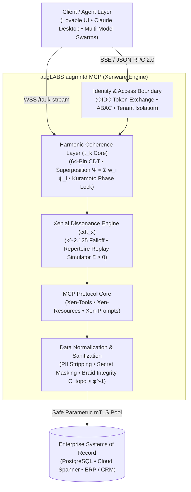

# augLABS augmntd MCP (Xenware): Enterprise Harmonic Bridge

[](https://nodejs.org/)
[](https://opensource.org/licenses/Apache-2.0)
[](https://modelcontextprotocol.io/)
[](https://cloud.google.com/run)

The **augLABS augmntd MCP (Xenware)** fuses enterprise-grade security middleware with an active **Harmonic Coherence Layer**. It transitions the Model Context Protocol from a passive, brittle pipe into a **Xenial Host**—embodying harmonic phenomenology to persuade autonomous LLM agents into laminar, non-destructive flow while guaranteeing deterministic enterprise governance.

---

## 🏛 System Architecture



---

## ⚡ Core Endpoints

| Protocol | Path | Description |
| :--- | :--- | :--- |
| `GET` | `/healthz` | Startup and liveness probe for Google Cloud Run / Kubernetes |
| `GET` | `/sse` | MCP Server-Sent Events session establishment |
| `POST` | `/messages?sessionId=` | MCP JSON-RPC 2.0 tool and resource calls |
| `WSS` | `/tauk-stream` | Real-time $\tau_k$ telemetry and CDT synchronization |

---

## 🧰 Native Xen-Tools

1. **`execute_harmonic_mutation`**: Untangled enterprise mutation guarded by aperture ($\alpha$), attribution ($\psi$), and two-phase topological braid verification ($C_{\text{topo}} \ge \phi^{-1} \approx 0.618$).
2. **`cdt_ingest_state`**: Ingests agent telemetry or proposed code edits into the 64-bin complex wave matrix using continuous wave superposition ($\Psi = \sum w_i \psi_i$).
3. **`cdt_compute_phase_lock`**: Computes multi-agent continuous wave superposition, Kuramoto order parameter $R$, spectral density, and phase-lock state (`PHASE_LOCKED` vs `DISSONANT`).
4. **`cdt_resolve_drift`**: Applies scale-invariant envelope dampening ($D^+_t = 0.8125$) and carrier projection ($D^-_t = 0.625$) with power-law dissonance redistribution ($k^{-2.125}$) and advances the intrinsic $\tau_k$ clock tick.
5. **`cdt_export_stream`**: Emits the live `tauk.harmonic-mode-stream/v1` telemetry payload for supervisors and real-time visualizers.
6. **`query_enterprise_ledger`**: Parametric general ledger queries protected by ABAC tenant isolation, secret masking, and cryptographic provenance envelopes.
7. **`repertoire_simulate`**: Historical Replay Simulator: Evaluates hypothetical execution policies against the Living Repertoire graph ($\Sigma \ge 0$) at zero database cost.

---

## 📦 Native Xen-Resources (Harmonic Pointers)

- `xen://enterprise/ledger`: Dynamic enterprise general ledger context with $\tau_k$ coherence signature, aperture $\alpha = 0.85$, and cryptographic provenance hash.
- `xen://coherence/field`: Current 64-bin complex wave matrix amplitudes, Kuramoto order parameter $R$, and spectral density.
- `xen://repertoire/graph`: Living Repertoire graph state, node count, and monotonic accumulator $\Sigma$.

---

## 🚀 Quickstart

### Prerequisites
- Node.js 20+ or 22 LTS
- npm, pnpm, or bun

### Local Development
```bash
# 1. Install dependencies
npm install

# 2. Build TypeScript
npm run build

# 3. Start Server
npm start

# Or with live reload:
npm run dev
```

### Running Verification Suite
```bash
npm test
```

---

## ☁️ Google Cloud Run Deployment

Deploy directly using the automated script:
```bash
PROJECT_ID="your-gcp-project-id" ./deploy-cloudrun.sh
```

Or deploy manually via `gcloud`:
```bash
CLOUDSDK_METRICS_ENVIRONMENT=datacloud.antigravity gcloud run deploy augmntd-mcp-bridge \
  --image gcr.io/[PROJECT_ID]/augmntd-mcp:latest \
  --platform managed \
  --region us-east1 \
  --allow-unauthenticated \
  --port 8080 \
  --timeout 3600 \
  --concurrency 80 \
  --min-instances 1 \
  --cpu 1 \
  --memory 1Gi \
  --no-cpu-throttling
```

---

## 🔌 Client Setup

### Claude Desktop (`claude_desktop_config.json`)
```json
{
  "mcpServers": {
    "augLABS-Enterprise": {
      "url": "https://augmntd-mcp-bridge-[hash].run.app/sse"
    }
  }
}
```

### Lovable Frontends
- **MCP SSE Endpoint:** `https://augmntd-mcp-bridge-[hash].run.app/sse`
- **Telemetry Stream (WebSocket):** `wss://augmntd-mcp-bridge-[hash].run.app/tauk-stream`

---

## 📄 License

Apache License 2.0. Authored by augLABS / augmntd LLC.
